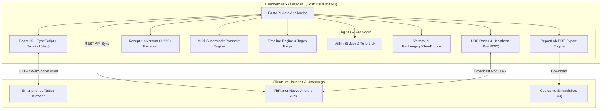

<div align="center">

# 🥗 FitPlaner • Smart Family Nutrition & Multi-Retailer Hub
### *Das autarke, 100% KI-freie Alltags-Betriebssystem für gesunde Familienernährung, Budgetkontrolle & Zero-Stress-Kochen*

[](https://github.com/meinzeug/fitplaner)
[](https://github.com/meinzeug/fitplaner)
[](https://fastapi.tiangolo.com)
[](https://react.dev)
[-3DDC84?style=for-the-badge&logo=android)](https://github.com/meinzeug/fitplaner)
[](https://github.com/meinzeug/fitplaner)
[-brightgreen?style=for-the-badge&logo=pytest)](https://github.com/meinzeug/fitplaner)
[](https://github.com/meinzeug/fitplaner)

<br/>

> **FitPlaner** verwandelt den stressigen Familienalltag und den Wocheneinkauf bei **Netto, NP, Lidl, Aldi Nord/Süd, Rewe, Kaufland & Edeka** in ein vollautomatisches, mathematisch optimiertes Erlebnis.  
> **1.220+ Offline-Rezepte. Kein Abo. Keine externen Cloud-APIs. PDF-Einkaufslisten-Export. Minutengenaue Tages-Regie & Tellertrick.**

---

</div>

<br/>

## 📰 DAS DIGITALE MAGAZIN: ALLE HIGHLIGHTS IM ÜBERBLICK

<table>
<tr>
<td width="33%" valign="top">

### 🌟 1. Vollvernetzte Startseite
**Jede Station führt direkt ans Ziel.**
- **Minutengenaue Tages-Regie**: 13 chronologische Stationen von 06:30 bis 22:30 Uhr.
- **Tiefenverlinkung**: Direkte Buttons zu Rezepten, Zubereitungsschritten, Brotdosen-Tipps und der Einkaufsliste.
- **Inline-Schnellansicht**: Kochanleitungen & Zutaten direkt auf der Karte aufklappen – ohne Extraklicks.
- **3-Stationen-Autopilot**: Morgens (Brotdose) → Feierabend (Frische-Pick) → Abends (Tellertrick).

</td>
<td width="33%" valign="top">

### 🍲 2. 1.220+ Rezepte-Universum
**100% KI-frei & Null Wiederholungen.**
- Riesige Offline-Rezeptdatenbank für **alle 11 Ernährungsweisen**:
  - *Mischkost, High Protein, Low Carb / Keto*
  - *Pescetarisch, Vegetarisch, Vegan*
  - *Schweinefleisch-Frei (No Pork)*
  - *Glutenfrei, Laktosefrei, Paleo, Budget*
- Schritt-für-Schritt Zubereitung mit Vorbereitungs- und Kochzeiten.
- Perfekt abgestimmte Brotdosen- und Meal-Prep-Tipps.

</td>
<td width="33%" valign="top">

### 🛒 3. Multi-Supermarkt Radar
**Echte Prospekte & Prospekt-Horizont.**
- Integration aller großen Ketten: **Netto, NP, Lidl, Aldi Nord, Aldi Süd, Rewe, Kaufland, Edeka**.
- **Realistischer Prospekt-Horizont**:
  - 🟢 *Aktive Woche*: Echte Angebote gültig ab Montag.
  - 🟡 *Vorschau-Woche*: Prospekt frisch verfügbar.
  - ⚪ *Folgewochen*: Vorausschauende Grundpreis- & Saisonplanung.
- Automatische Berücksichtigung von Prospekt-Knallern.

</td>
</tr>
<tr>
<td width="33%" valign="top">

### 📄 4. PDF-Einkaufslisten-Export
**Druckfertig & gangoptimiert für den Markt.**
- Professionelle PDF-Generierung mit **ReportLab**.
- **Sortiert nach Markt-Laufweg**:
  1. *Obst & Gemüse* (Markt-Eingang)
  2. *Kühlregal & Molkerei*
  3. *Fleisch & Frischer Fisch*
  4. *Trockensortiment & Vorräte*
- Mit druckfertigen Checkboxen `[ ]`, Supermarkt-Farbkodierung, Packungsgrößen und Preissummen.

</td>
<td width="33%" valign="top">

### 🍽️ 5. Der faire Tellertrick
**Schluss mit grammgenauem Wiegen am Herd.**
- **Ein** Gericht für die ganze Familie kochen.
- Portionierung nach intuitiven **Kellenmaßen**:
  - *Dennis (Muskelaufbau)*: 🥄 3 Kellen Hauptgericht + 1 gehäufte Handvoll Reis.
  - *Sarah (Kaloriendefizit)*: 🥄 1,5 Kellen Hauptgericht + 2 lockere Hände Salat.
- Basiert auf exakter Mifflin-St Jeor BMR/TDEE-Formel.

</td>
<td width="33%" valign="top">

### 📦 6. Vorratskammer & Barcode
**Zero Waste & Null Doppelkäufe.**
- EAN-13 Barcode-Scanner & Kassenbon-Erfassung.
- **Automatischer Lager-Abzug**: Was bereits zuhause vorrätig ist, kostet auf der Einkaufsliste **0,00 €**!
- Frische-Ampel nach Mindesthaltbarkeit (MHD).
- **„Gekocht & Lager abbuchen“**: Zieht verbrauchte Mengen mit 1 Klick aus dem Lager ab.

</td>
</tr>
<tr>
<td width="33%" valign="top">

### 📅 7. Wöchentliche Budgets
**Multi-Wochen-Navigation & Spar-Ampel.**
- Beliebig vor- und zurückblättern (KW 36, KW 37, KW 38...).
- Individuelles Wochenbudget festlegbar (z. B. 120 € oder Monatsende-Sparwoche mit 60 €).
- Live Restbudget-Berechnung & Warn-Ampel (🟢 / 🟡 / 🔴).
- Transparente Spar- und Deckungsübersicht.

</td>
<td width="33%" valign="top">

### 🥪 8. 12-Min.-Vorabend-Trick
**Morgens 0 Minuten Stress.**
- **20:00 Uhr Station**: Vorbereitung der Brotdose und des Frühstücks für den nächsten Tag in nur 12 Minuten.
- Overnight-Oats quellen über Nacht im Kühlschrank.
- Morgens einfach nur die fertigen Dosen greifen (**30-Sekunden-Grab-and-Go**).

</td>
<td width="33%" valign="top">

### 📱 9. Android APK & WLAN-Radar
**Immer synchron im ganzen Haushalt.**
- Native Android-App (**FitPlaner.apk**, 4,2 MB) direkt zum Download verlinkt.
- **Zero-Config Auto-Discovery**: Linux-Server und Handy finden sich automatisch über UDP-Broadcast auf **Port 8092**.
- Offline-Modus im Supermarkt ohne Funkloch-Ärger.

</td>
</tr>
</table>

---

## 🏛️ GESAMT-ARCHITEKTUR & SYSTEM-TOPOLOGIE

FitPlaner ist modular, robust und vollständig unabhängig von externen Cloud-Diensten konzipiert:



---

## ⏱️ DIE MINUTENGENAUE TAGES-REGIE

Der Ernährungs-Zeitplaner steuert deinen Tag chronologisch und nimmt dir jede mentale Belastung ab:

| Uhrzeit | Station / Mission | Typ | Verlinkung & Nutzen |
| :--- | :--- | :--- | :--- |
| **06:30** | ☀️ **Morgen-Start & Hydration** | Wasser | 1 großes Glas lauwarmes Wasser (300–500ml) für Dennis & Sarah (Stoffwechsel-Kick). |
| **06:45** | 🎒 **Brotdosen-Grab-and-Go** | Prep | Gestern vorbereitete Dosen & Snackboxen aus dem Kühlschrank in die Taschen packen (**30 Sekunden!**). |
| **07:00** | 🥣 **Frühstück lt. Wochenplan** | Mahlzeit | 🍳 **Rezept & Zubereitung verlinkt** • z. B. Vollkorn-Müsli mit Beeren & Leinsamen. |
| **10:30** | 🍎 **Vormittags-Snack** | Snack | Dennis: Handvoll Walnüsse (Muskelschutz); Sarah: Apfel & Gurkensticks (Sättigung ohne Kalorienlast). |
| **12:30** | 🍱 **Mittagspause to-go** | Mahlzeit | 🥗 **Rezept verlinkt** • Vollwertige Brotdose (z. B. Quinoa-Bowl mit Kichererbsen). Keine teuren Kantinen! |
| **15:30** | 💧 **Nachmittags-Booster** | Wasser | 500ml Wasser oder Grüntee + Magerquark/Mandarine gegen das 15-Uhr-Leistungstief. |
| **16:45** | ⏰ **Feierabend-Vorausblick** | Frische | 🛒 **Zur Einkaufsliste verlinkt** • 15 Min. vor Feierabend: Erinnerung an Halt bei Netto/NP. |
| **17:15** | 🛒 **Frische-Pick im Markt** | Frische | 🛒 **Einkaufsliste & Marktregal** • Frischen Lachs, Geflügel oder Spinat auf dem Heimweg mitnehmen. |
| **18:00** | 🍳 **Herd-Regie & Koch-Start** | Kochen | 🍳 **Zubereitungsschritte & Timer** • Schnelle Zubereitung in meist nur 1 Pfanne/Topf. |
| **18:30** | 🍽️ **Familien-Dinner (Tellertrick)** | Mahlzeit | 🍽️ **Tellertrick am Herd** • Servieren nach Kellenmaßen ohne Küchenwaage. |
| **20:00** | 🥪 **Brotdose für MORGEN vorbereiten** | Prep | 🍱 **Morgen-Rezepte verlinkt** • **Der 12-Minuten-Vorabend-Trick:** Overnight-Oats anrühren, Boxen füllen. |
| **20:45** | ❄️ **TK-Auftau-Check** | Vorrat | 📦 **Vorratskammer verlinkt** • Schonendes Auftauen im Kühlschrank für übermorgen. |
| **21:45** | 🌙 **Abend-Hydration & Bettruhe** | Wasser | Kräutertee, Magnesium, Regeneration für tiefen, erholsamen Schlaf. |

---

## 🍽️ DER FAIRE TELLERTRICK: SERVIEREN AM HERD

Vergiss das grammgenaue Abwiegen einzelner Zutaten nach Feierabend. Der **Tellertrick** übersetzt wissenschaftliche Nährwertberechnungen (Mifflin-St Jeor) direkt in **Küchen-Haushaltsmaße am Herd**:

```
🥘 Beispielgericht: Rote-Linsen-Curry mit Kokosmilch & Babyspinat
├── 👤 Dennis (Ziel: Muskelaufbau • 2.650 kcal)
│   ├── 🥄 3 volle Kellen Linsen-Curry
│   └── 🍚 1 gehäufte Handvoll Naturreis
└── 👤 Sarah (Ziel: Fettabbau • 1.700 kcal)
    ├── 🥄 1,5 Kellen Linsen-Curry
    └── 🥗 2 lockere Hände Frischer Salat / Rohkost
```

---

## 📄 PROFESSIONELLER PDF-EINKAUFSLISTEN-EXPORT

Mit einem Klick auf **„📄 PDF herunterladen“** im Tab *Einkauf & Lager* erzeugt FitPlaner eine druckfertige Einkaufsliste im DIN-A4-Format:

- **Sortiert nach Markt-Gängen**: Obst & Gemüse → Kühlung & Fleisch → Trockensortiment & Vorräte.
- **Druckfertige Checkboxen `[ ]`**: Zum manuellen Durchstreichen mit dem Kugelschreiber.
- **Klare Mengenangaben**: Basierend auf realen Supermarkt-Packungsgrößen (z. B. *2x 500g Haferflocken*).
- **Multi-Supermarkt-Kennzeichnung**: Jeder Artikel ist mit dem günstigsten Markt (Netto, NP, Lidl, Aldi, Rewe etc.) gekennzeichnet.
- **KPI-Übersichtsleiste**: Geschätzte Gesamtkosten, bereits vorrätige Artikel und Sparsummen auf einen Blick.

---

## 🥗 DAS REZEPTE-UNIVERSUM (1.220+ OFFLINE-REZEPTE)

FitPlaner enthält eine kuratierte Offline-Bibliothek aus über 1.220 Rezepten, die alle gängigen Ernährungsformen abdecken:

| Ernährungsform | Typische Zutaten | Fokus |
| :--- | :--- | :--- |
| **Mischkost (Ausgewogen)** | Mageres Fleisch, Vollkorn, Gemüse, gesunde Fette | Ausgewogene Makronährstoffe für die ganze Familie |
| **High Protein / Muskelaufbau** | Hähnchenbrust, Magerquark, Eier, Hülsenfrüchte | Hohe biologische Wertigkeit, Muskelschutz |
| **Low Carb & Keto** | Lachs, Avocado, Nüsse, Brokkoli, Blumenkohl | Minimale Insulinausschüttung, stabile Energie |
| **Pescetarisch** | Wildlachs, Kabeljau, Thunfisch, Garnelen, Gemüse | Gesunde Omega-3-Fettsäuren |
| **Vegetarisch** | Eier, Hüttenkäse, Kichererbsen, Linsen, Tofu | Vollwertige fleischlose Proteinquellen |
| **Vegan** | Hülsenfrüchte, Nüsse, Samen, Vollkorngetreide | 100% pflanzlich mit Fokus auf Mikronährstoffe |
| **No Pork (Schweinefleisch-Frei)** | Rindfleisch, Geflügel, Fisch, vegetarische Alternativen | 100% frei von Schweinefleisch & Gelatine |
| **Glutenfrei / Laktosefrei** | Reis, Quinoa, Kartoffeln, laktosefreie Milchprodukte | Maximale Bekömmlichkeit bei Unverträglichkeiten |
| **Paleo / Clean Eating** | Unverarbeitetes Fleisch, Fisch, Nüsse, Obst, Gemüse | Streng frei von Industriezucker und Zusatzstoffen |
| **Budget-Sparfuchs** | Haferflocken, Karotten, Linsen, Kartoffeln, Eier | Maximal gesunde Nährstoffe unter 2,50 € pro Tag |

---

## 📱 ANDROID APP & AUTO-DISCOVERY RADAR

Die native Android-App (`FitPlaner.apk`) verbindet sich vollautomatisch mit deinem PC:

1. **APK Herunterladen**: Direkt im Dashboard über das Menü oder den Footer herunterladen (ca. 4,2 MB).
2. **Im WLAN öffnen**: Die App lauscht auf den UDP-Broadcast auf **Port 8092**.
3. **Zero-Config Sync**: Sobald du nach dem Einkauf nach Hause kommst, werden abgehakte Artikel und verbrauchte Vorräte automatisch mit dem Haupt-PC synchronisiert.
4. **Offline-Funktion**: Im Supermarkt funktioniert die App auch im tiefsten Funkloch vollständig autark.

---

## 🚀 SCHNELLSTART & INSTALLATION AUF LINUX

FitPlaner lässt sich mit einem einzigen Befehl auf jedem Linux-PC (Ubuntu, Debian, Fedora, Arch, Manjaro etc.) installieren:

```bash
# 1. Repository klonen
git clone https://github.com/meinzeug/fitplaner.git
cd fitplaner

# 2. Einrichtungs-Skript ausführen
./setup.sh

# 3. Server starten
./run.sh
```

### 🌐 Zugriffs-Adressen:
- **Lokaler PC (Browser)**: `http://localhost:8090`
- **Smartphones / Tablets im WLAN**: `http://<DEINE-PC-IP>:8090` *(wird vom Skript automatisch angezeigt)*
- **Direkter APK-Download**: `http://<DEINE-PC-IP>:8090/FitPlaner.apk`
- **Linux-Anwendungsmenü**: Suche einfach nach **„FitPlaner“** und starte es per Klick!

---

## 🧪 TESTSUITE & QUALITÄTSSICHERUNG

FitPlaner wird durch eine lückenlose Testsuite aus **38 automatisierten Unit-Tests** abgesichert:

```bash
.venv/bin/python3 -m unittest discover backend/tests
```

```
......................................
----------------------------------------------------------------------
Ran 38 tests in 0.449s

OK
```

### Abgedeckte Testbereiche:
- `test_pdf_export.py`: Validierung des PDF-Binärstreams (`%PDF-1.4`), Tabellenlayout und Header.
- `test_recipe_universe.py`: Testet 1.220 Rezepte, alle 11 Ernährungsweisen, Rotationslogik und Prospekt-Horizont.
- `test_timeline_schedule.py`: Testet die 13 chronologischen Stationen, Zeitanpassungen und Vorabend-Mealprep.
- `test_daily_hub.py`: Testet Öffnungszeiten, Feierabend-Alarm, Frische-Pick und Kellen-Tellertrick.
- `test_installer.py`: Testet lokale IP-Erkennung, QR-Code-SVG-Generierung und WLAN-Pairing.
- `test_budget_and_weeks.py`: Testet ISO-Wochenberechnung, Multi-Wochen-Offset und Budget-Ampel.
- `test_nutrition.py`: Testet Mifflin-St Jeor BMR/TDEE-Berechnung und individuelle Makroverteilung.
- `test_pantry.py`: Testet Lagerabbuchung, Mindesthaltbarkeits-Ampel und Kassenbon-Parsing.
- `test_health_filter.py`: Testet automatische Erkennung und Ausschluss schädlicher E-Nummern und versteckter Zucker.

---

## 🛠️ TECHNOLOGIE-STACK

| Komponente | Technologie | Zweck / Besonderheit |
| :--- | :--- | :--- |
| **Backend-Framework** | Python 3.12, FastAPI, Uvicorn | Vollständig asynchron, Pydantic v2 validiert, gebunden an `0.0.0.0:8090` |
| **Frontend-UI** | React 19, TypeScript, Vite, Tailwind CSS | Schnelle Ladezeiten (< 1s Build), moderne Glasmorphismus-Komponenten |
| **Dokumenten-Engine** | ReportLab PDF Engine | Druckfertige A4 Einkaufslisten mit Checkboxen und Vektorgrafiken |
| **Netzwerk & Sync** | UDP Socket Broadcast, ARP Subnet-Probe | Port 8092 Auto-Discovery ohne manuelle IP-Eingabe |
| **Mobile Runtime** | Capacitor 7, Android SDK 34/35 | Native Android APK (4,2 MB) mit Kamera-Barcode-Scanner |
| **Datenbestand** | Lokales JSON & SQLite | 100% offline nutzbar, null Tracking, absolute Datensouveränität |

---

## 📄 LIZENZ & CREDITS

Entwickelt für **Dennis & Familie** von `meinzeug`.  
Open Source unter MIT-Lizenz. Frei nutzbar für maximale Gesundheit, stressfreien Familienalltag und faire Haushaltsfinanzen.
