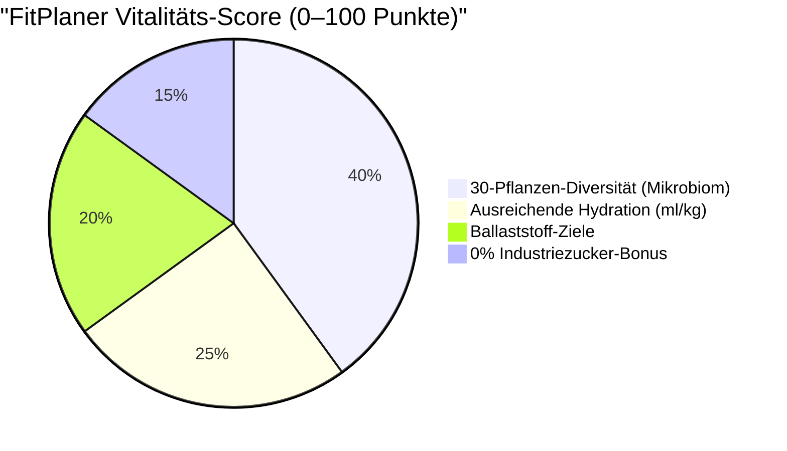

<div align="center">

# 🥗 FitPlaner • Family Health Super App & Multi-Retailer Hub
### *Das autarke, 100% KI-freie Alltags-Betriebssystem für maximale Familiengesundheit, altersgerechte Küchen-Ämtli & dezentralen WLAN/Bluetooth-Mesh-Sync*

[](https://github.com/meinzeug/fitplaner)
[](https://github.com/meinzeug/fitplaner)
[](https://fastapi.tiangolo.com)
[](https://react.dev)
[-3DDC84?style=for-the-badge&logo=android)](https://github.com/meinzeug/fitplaner)
[](https://github.com/meinzeug/fitplaner)
[-brightgreen?style=for-the-badge&logo=pytest)](https://github.com/meinzeug/fitplaner)
[](https://github.com/meinzeug/fitplaner)
[](https://github.com/meinzeug/fitplaner)
[](https://github.com/meinzeug/fitplaner)

<br/>

> **FitPlaner** ist die All-in-One **Super App für die Familie**: Sie vereint kompromisslose **Präventions-Gesundheit** (30-Pflanzen-Mikrobiom-Challenge, altersgerechte Nährstoffe, Hydrations-Tracker), **faire Aufgabenverteilung in der Küche** nach Entwicklungsstufen (Mini, Kid, Teen, Junior, Erwachsener) mit spielerischem Sternepott und einen **halb-autarken Peer-to-Peer Mesh-Abgleich** via **WLAN & Bluetooth LE** zwischen allen Familien-Smartphones.  
> **1.220+ Offline-Rezepte. Kein Abo. Keine externen Cloud-APIs. 100% autark untereinander. Internet nur für Prospekte.**

---

</div>

<br/>

## 📰 DAS DIGITALE MAGAZIN: ALLE HIGHLIGHTS IM ÜBERBLICK

<table>
<tr>
<td width="33%" valign="top">

### 🌿 1. Vitalitäts-Radar & 30 Pflanzen
**Maximale Darm- & Zellgesundheit für alle.**
- **30-Pflanzen-Wochen-Challenge**: Erfasst automatisch Vollkorn, Nüsse, Samen, Hülsenfrüchte, Gemüse & Obst nach *American Gut Project*.
- **0–100 Vitality Radar**: Ganzheitlicher Score aus Pflanzen-Diversität, Ballaststoffen, Hydration & 0% Industriezucker.
- **Interaktiver Wasser-Tracker**: Individuelle Zielmengen nach Körpergewicht (ml/kg) mit Schnell-Button `+250 ml`.
- **Altersgerechte Nährstoff-Booster**: Spezifische Empfehlungen für Knochen, Konzentration, Muskeln & Herz.

</td>
<td width="33%" valign="top">

### 🤝 2. Altersgerechte Küchen-Ämtli
**Faire Arbeitsaufteilung nach Entwicklungsalter.**
- **Entwicklungsstufen-Katalog**:
  - 👶 *Mini (3–5 J.)*: Beeren waschen, Salat zupfen.
  - 🧒 *Kid (6–9 J.)*: Tisch decken, Haferflocken wiegen, Gurken schälen.
  - 🧑 *Teen (10–14 J.)*: Gemüse würfeln, Schul-Snack packen, Pfanne rühren.
  - 🧑‍🍳 *Junior (15–18 J.)*: One-Pan kochen, Overnight-Oats, Frische-Pick.
  - 👨‍👩‍👦 *Erwachsene (19+ J.)*: Herd-Regie, Heißes Braten & Wochenplanung.
- **Sternepott-Gamification**: Jede erledigte Aufgabe bringt Vital-Sterne für ein gemeinsames Familien-Ziel (z. B. 50 Sterne = Familienausflug!).

</td>
<td width="33%" valign="top">

### 📶 3. Dezentraler P2P Mesh-Sync
**Autark untereinander – ohne Fremd-Server.**
- **WLAN & Bluetooth LE Direkt-Abgleich**:
  - Handys der Familienmitglieder synchronisieren sich automatisch untereinander, sobald sie in Funkreichweite sind.
  - Funktioniert im Heimnetzwerk (UDP Broadcast / Multicast) sowie direkt per **Bluetooth LE GATT** ohne Router.
- **Konfliktfreier Delta-Sync**: Einkaufslisten-Häkchen, erledigte Aufgaben und Trinkmengen verschmelzen nahtlos per Set-Union & LWW.
- **Internet nur für Prospekte**: Absolute Privatsphäre – Familiendaten verlassen niemals die eigenen Geräte.

</td>
</tr>
<tr>
<td width="33%" valign="top">

### 🌟 4. Vollvernetzte Startseite
**Jede Station führt direkt ans Ziel.**
- **Minutengenaue Tages-Regie**: 13 chronologische Stationen von 06:30 bis 22:30 Uhr.
- **Tiefenverlinkung**: Direkte Buttons zu Rezepten, Zubereitungsschritten, Brotdosen-Tipps und der Einkaufsliste.
- **Inline-Schnellansicht**: Kochanleitungen & Zutaten direkt auf der Karte aufklappen – ohne Extraklicks.
- **3-Stationen-Autopilot**: Morgens (Brotdose) → Feierabend (Frische-Pick) → Abends (Tellertrick).

</td>
<td width="33%" valign="top">

### 🍲 5. 1.220+ Rezepte-Universum
**100% KI-frei & Null Wiederholungen.**
- Riesige Offline-Rezeptdatenbank für **alle 11 Ernährungsweisen**:
  - *Mischkost, High Protein, Low Carb / Keto*
  - *Pescetarisch, Vegetarisch, Vegan*
  - *Schweinefleisch-Frei (No Pork)*
  - *Glutenfrei, Laktosefrei, Paleo, Budget*
- Schritt-für-Schritt Zubereitung mit Vorbereitungs- und Kochzeiten.
- Perfekt abgestimmte Brotdosen- und Meal-Prep-Tipps.

</td>
<td width="33%" valign="top">

### 🛒 6. Multi-Supermarkt Radar
**Echte Prospekte & Prospekt-Horizont.**
- Integration aller großen Ketten: **Netto, NP, Lidl, Aldi Nord, Aldi Süd, Rewe, Kaufland, Edeka**.
- **Realistischer Prospekt-Horizont**:
  - 🟢 *Aktive Woche*: Echte Angebote gültig ab Montag.
  - 🟡 *Vorschau-Woche*: Prospekt frisch verfügbar.
  - ⚪ *Folgewochen*: Vorausschauende Grundpreis- & Saisonplanung.
- Automatische Berücksichtigung von Prospekt-Knallern.

</td>
</tr>
<tr>
<td width="33%" valign="top">

### 📄 7. PDF-Einkaufslisten-Export
**Druckfertig & gangoptimiert für den Markt.**
- Professionelle PDF-Generierung mit **ReportLab**.
- **Sortiert nach Markt-Laufweg**:
  1. *Obst & Gemüse* (Markt-Eingang)
  2. *Kühlregal & Molkerei*
  3. *Fleisch & Frischer Fisch*
  4. *Trockensortiment & Vorräte*
- Mit druckfertigen Checkboxen `[ ]`, Supermarkt-Farbkodierung, Packungsgrößen und Preissummen.

</td>
<td width="33%" valign="top">

### 🍽️ 8. Der faire Tellertrick
**Schluss mit grammgenauem Wiegen am Herd.**
- **Ein** Gericht für die ganze Familie kochen.
- Portionierung nach intuitiven **Kellenmaßen**:
  - *Dennis (Muskelaufbau)*: 🥄 3 Kellen Hauptgericht + 1 gehäufte Handvoll Reis.
  - *Sarah (Kaloriendefizit)*: 🥄 1,5 Kellen Hauptgericht + 2 lockere Hände Salat.
  - *Kinder / Jugendliche*: Altersgerechte Kellenportionen ohne Diätstress.
- Basiert auf exakter Mifflin-St Jeor BMR/TDEE-Formel.

</td>
<td width="33%" valign="top">

### 📦 9. Vorratskammer & Barcode
**Zero Waste & Null Doppelkäufe.**
- EAN-13 Barcode-Scanner & Kassenbon-Erfassung.
- **Automatischer Lager-Abzug**: Was bereits zuhause vorrätig ist, kostet auf der Einkaufsliste **0,00 €**!
- Frische-Ampel nach Mindesthaltbarkeit (MHD).
- **„Gekocht & Lager abbuchen“**: Zieht verbrauchte Mengen mit 1 Klick aus dem Lager ab.

</td>
</tr>
<tr>
<td width="33%" valign="top">

### 📅 10. Wöchentliche Budgets
**Multi-Wochen-Navigation & Spar-Ampel.**
- Beliebig vor- und zurückblättern (KW 36, KW 37, KW 38...).
- Individuelles Wochenbudget festlegbar (z. B. 120 € oder Sparwoche mit 60 €).
- Live Restbudget-Berechnung & Warn-Ampel (🟢 / 🟡 / 🔴).
- Transparente Spar- und Deckungsübersicht.

</td>
<td width="33%" valign="top">

### 🥪 11. 12-Min.-Vorabend-Trick
**Morgens 0 Minuten Stress.**
- **20:00 Uhr Station**: Vorbereitung der Brotdose und des Frühstücks für den nächsten Tag in nur 12 Minuten.
- Overnight-Oats quellen über Nacht im Kühlschrank.
- Morgens einfach nur die fertigen Dosen greifen (**30-Sekunden-Grab-and-Go**).

</td>
<td width="33%" valign="top">

### 📱 12. Android APK & Mesh-Pairing
**Immer synchron im ganzen Haushalt.**
- Native Android-App (**FitPlaner.apk**) direkt im Heimnetz verlinkt.
- Bluetooth LE & WLAN-Multicast Berechtigungen direkt integriert.
- Automatische Erkennung anderer Familien-Geräte in Funkreichweite.
- 100% Offline-Betrieb im Supermarkt ohne Mobilfunk.

</td>
</tr>
</table>

---

## 🌿 FAMILIENGESUNDHEIT & DAS 30-PFLANZEN-MIKROBIOM-RADAR

Gesundheit ist kein Zufall, sondern die Summe täglicher Routinen. Das integrierte **Vitalitäts-Radar** fokussiert sich auf die zentralen Säulen moderner Präventionsmedizin:



### 🧬 Die 30-Pflanzen-Challenge
Studien des renommierten *American Gut Project* belegen: Menschen, die pro Woche mindestens **30 verschiedene pflanzliche Lebensmittel** (Gemüse, Obst, Vollkorn, Hülsenfrüchte, Nüsse, Samen, Kräuter) verzehren, verfügen über ein signifikant vielfältigeres Darm-Mikrobiom, ein stärkeres Immunsystem und eine optimierte mentale Leistungsfähigkeit.
- FitPlaner scannt alle im Wochenplan enthaltenen Rezepte automatisch.
- Jede Zutat wird kategorisiert (`Kategorie: Hülsenfrüchte, Nüsse, Beeren, Blattgemüse, Vollkorn`).
- Ein interaktiver Fortschrittsbalken zeigt der Familie auf einen Blick, wie viele der 30 Pflanzen in der aktuellen Woche bereits erreicht sind.

### 💧 Wissenschaftlicher Hydrations-Tracker
Wasser ist der wichtigste Nährstoff des Körpers. FitPlaner berechnet für jedes Familienmitglied den individuellen Bedarf:
- **Formel**: 35–40 ml Wasser pro Kilogramm Körpergewicht.
- **Interaktives Logging**: Mit dem Schnell-Button `+250 ml` loggt jedes Familienmitglied sein getrunkenes Glas Wasser direkt in der App.
- **P2P-Sync**: Der aktuelle Wasserstand synchronisiert sich automatisch mit allen Familien-Geräten.

### 🎯 Altersgerechte Nährstoff-Booster
| Altersstufe | Zielgruppe | Nährstoff-Fokus | FitPlaner Booster-Lebensmittel |
| :--- | :--- | :--- | :--- |
| **Mini (3–5 J.)** | Felix | Calcium, Vitamin D, gesunde Fette | Magerquark, Beeren, Sesam, Mandelmus |
| **Kid (6–9 J.)** | Felix | Ballaststoffe, Eisen, langkettige Carbs | Haferflocken, Karotten-Sticks, Erbsen, Äpfel |
| **Teen (10–14 J.)** | Lea | Eisen, Omega-3, Zink, B-Vitamine | Leinsamen, Walnüsse, Linsen, Kürbiskerne |
| **Junior (15–18 J.)** | Jugend | Biologisches Protein, Magnesium | Kichererbsen, Quinoa, Sonnenblumenkerne |
| **Adult (19+ J.)** | Dennis & Sarah | Herz-Kreislauf, Polyphenole, Muskelschutz | Olivenöl, dunkle Beeren, Brokkoli, Ingwer |

---

## 🤝 ALTERSGERECHTE KÜCHEN-ÄMTLI & STERNEPOTT-GAMIFICATION

Gemeinsam kochen und die Küche sauber halten schweißt die Familie zusammen und nimmt den Eltern die gesamte mentale Last ab. FitPlaner teilt Aufgaben automatisch nach dem Entwicklungsalter zu:

```
                          🌟 DER FAMILIEN-STERNEPOTT 🌟
          [★★★★★★★★★★★★★★★★★★★★····················] 24 / 50 Sterne
                      🎯 Ziel: Gemeinsamer Kino- & Badetag!
```

### 📋 Der Ämtli-Katalog nach Entwicklungsstufen:
- **👶 Mini (3–5 Jahre)**:
  - 🍓 *Beeren waschen* (Früchte in Sieb spülen) • `+2 ★`
  - 🥬 *Salatblätter zupfen* (Blätter schonend zerteilen) • `+2 ★`
  - 🥄 *Servietten verteilen* (Auf die Plätze legen) • `+1 ★`
- **🧒 Kid (6–9 Jahre)**:
  - 🍽️ *Tisch eindecken* (Teller, Besteck, Gläser aufstellen) • `+3 ★`
  - 🥣 *Haferflocken abmessen* (Müsli mit Kelle in Schalen füllen) • `+2 ★`
  - 🥕 *Gurken & Karotten schälen* (Mit sicherem Sparschäler) • `+3 ★`
  - 🥤 *Wassergläser einschenken* (Frisches Wasser für alle) • `+2 ★`
- **🧑 Teen (10–14 Jahre)**:
  - 🥒 *Gemüse würfeln* (Paprika, Zucchini mundgerecht schneiden) • `+4 ★`
  - 🎒 *Schul-Brotdose packen* (Gemüsesticks & Nüsse einpacken) • `+3 ★`
  - 🍳 *Pfanne rühren* (Zutaten bei mittlerer Hitze wenden) • `+3 ★`
  - 🍽️ *Geschirrspüler ausräumen* (Sauberes Geschirr verstauen) • `+4 ★`
- **🧑‍🍳 Junior (15–18 Jahre)**:
  - 🥘 *Eigenständiges One-Pan Gericht* (Komplettes Pfannengericht zubereiten) • `+6 ★`
  - 🌙 *Overnight-Oats für alle vorbereiten* (Gläser für den Morgen anrühren) • `+4 ★`
  - 🛒 *Frische-Pick im Markt abholen* (Auf dem Heimweg frische Zutaten besorgen) • `+5 ★`
- **👨‍👩‍👦 Erwachsene (19+ Jahre)**:
  - 🔥 *Herd-Regie & Heißes Braten* (Scharfes Anbraten, Kochstellen-Sicherheit) • `+3 ★`
  - 📅 *Wochenplan & Prospekt-Abgleich* (Budget- & Angebotsprüfung) • `+3 ★`
  - 🧹 *Küchen-Endreinigung* (Arbeitsplatten & Herd nach dem Kochen säubern) • `+4 ★`

---

## 📶 HALB-AUTARKES PEER-TO-PEER MESH (WLAN & BLUETOOTH LE)

FitPlaner ist als **halb-autarkes Netzwerk** konzipiert:
1. **Autark im Haushalt**: Alle Familiendaten (Einkaufslisten-Häkchen, Küchen-Ämtli, Trinkmengen, Wochenpläne, Vorratsstände) verbleiben ausschließlich auf den Geräten der Familie.
2. **Direkte Synchronisation**: Die Handys der Familienmitglieder tauschen Daten direkt per **lokalem WLAN** oder **Bluetooth Low Energy (BLE)** aus, wenn sie sich begegnen.
3. **Internet nur für Prospekte**: Eine Internetverbindung wird ausschließlich benötigt, wenn neue Supermarkt-Prospekte (Netto, Lidl, Aldi, Rewe etc.) heruntergeladen werden.

```mermaid
graph TB
    subgraph "Heimnetzwerk / Linux Server (Host: 0.0.0.0:8090)"
        CoreServer["FastAPI Core Application"]
        
        subgraph "Super App Engines"
            VitalityEng["Vitalitäts-Radar & 30-Pflanzen-Engine"]
            ChoreEng["Altersgerechte Küchen-Ämtli & Gamification"]
            MeshSyncEng["P2P Mesh Engine (WLAN & BLE Bridge)"]
            RecipeUniv["Rezept-Universum (1.220+ Rezepte)"]
            MultiLeaflet["Multi-Supermarkt Prospekt-Engine"]
            TimelineEng["Timeline Engine & Tages-Regie"]
            NutritionEng["Mifflin-St Jeor & Tellertrick"]
            PantryEng["Vorrats- & Packungsgrößen-Engine"]
            PDFGen["ReportLab PDF-Export-Engine"]
        end

        WebFrontend["React 19 + TypeScript + Tailwind"]
    end

    subgraph "Familienmitglieder (Mobile Devices in Reichweite)"
        Phone1["📱 Handy Dennis (Papa / Adult)"]
        Phone2["📱 Handy Sarah (Mama / Adult)"]
        Phone3["📱 Tablet Lea (12J / Teen)"]
        Phone4["📱 Handy Felix (8J / Kid)"]
    end

    subgraph "Autarke Peer-to-Peer Vernetzung"
        P2PWLAN["📶 Lokales WLAN (UDP Broadcast / Multicast)"]
        P2PBLE["🔵 Bluetooth LE GATT Service (0000ffe0)"]
    end

    CoreServer --> VitalityEng
    CoreServer --> ChoreEng
    CoreServer --> MeshSyncEng
    CoreServer --> RecipeUniv
    CoreServer --> MultiLeaflet
    CoreServer --> TimelineEng
    CoreServer --> NutritionEng
    CoreServer --> PantryEng
    CoreServer --> PDFGen
    CoreServer --> WebFrontend

    Phone1 <-->|P2P Mesh| P2PWLAN
    Phone2 <-->|P2P Mesh| P2PWLAN
    Phone3 <-->|P2P Mesh| P2PWLAN
    Phone4 <-->|P2P Mesh| P2PWLAN

    Phone1 <-->|Bluetooth LE Ad-hoc| P2PBLE
    Phone2 <-->|Bluetooth LE Ad-hoc| P2PBLE
    Phone3 <-->|Bluetooth LE Ad-hoc| P2PBLE
    Phone4 <-->|Bluetooth LE Ad-hoc| P2PBLE

    CoreServer <-->|LAN Sync / HTTP 8090| P2PWLAN
```



### 🔵 Bluetooth LE GATT Spezifikation:
- **Service UUID**: `0000ffe0-0000-1000-8000-00805f9b34fb`
- **Data Characteristic UUID**: `0000ffe1-0000-1000-8000-00805f9b34fb` (Read, Write Without Response, Notify)
- **Status Characteristic UUID**: `0000ffe2-0000-1000-8000-00805f9b34fb` (Read, Notify)
- **Konfliktfreie Verschmelzung**: Verwendet Last-Write-Wins (LWW) und Set-Union für Einkaufs-Checkboxen und Ämtli-Status.

---

## ⏱️ DIE MINUTENGENAUE TAGES-REGIE

Der Ernährungs-Zeitplaner steuert deinen Tag chronologisch und nimmt dir jede mentale Belastung ab:

| Uhrzeit | Station / Mission | Typ | Verlinkung & Nutzen |
| :--- | :--- | :--- | :--- |
| **06:30** | ☀️ **Morgen-Start & Hydration** | Wasser | 1 großes Glas lauwarmes Wasser (300–500ml) für Dennis & Sarah (Stoffwechsel-Kick). |
| **06:45** | 🎒 **Brotdosen-Grab-and-Go** | Prep | Gestern vorbereitete Dosen & Snackboxen aus dem Kühlschrank in die Taschen packen (**30 Sekunden!**). |
| **07:00** | 🥣 **Frühstück lt. Wochenplan** | Mahlzeit | 🍳 **Rezept & Zubereitung verlinkt** • z. B. Vollkorn-Müsli mit Beeren & Leinsamen. |
| **10:30** | 🍎 **Vormittags-Snack** | Snack | Dennis: Handvoll Walnüsse (Muskelschutz); Sarah: Apfel & Gurkensticks (Sättigung ohne Kalorienlast). |
| **12:30** | 🍱 **Mittagspause to-go** | Mahlzeit | 🥗 **Rezept verlinkt** • Vollwertige Brotdose (z. B. Quinoa-Bowl mit Kichererbsen). Keine teuren Kantinen! |
| **15:30** | 💧 **Nachmittags-Booster** | Wasser | 500ml Wasser oder Grüntee + Magerquark/Mandarine gegen das 15-Uhr-Leistungstief. |
| **16:45** | ⏰ **Feierabend-Vorausblick** | Frische | 🛒 **Zur Einkaufsliste verlinkt** • 15 Min. vor Feierabend: Erinnerung an Halt bei Netto/NP. |
| **17:15** | 🛒 **Frische-Pick im Markt** | Frische | 🛒 **Einkaufsliste & Marktregal** • Frischen Lachs, Geflügel oder Spinat auf dem Heimweg mitnehmen. |
| **18:00** | 🍳 **Herd-Regie & Koch-Start** | Kochen | 🍳 **Zubereitungsschritte & Timer** • Schnelle Zubereitung in meist nur 1 Pfanne/Topf. |
| **18:30** | 🍽️ **Familien-Dinner (Tellertrick)** | Mahlzeit | 🍽️ **Tellertrick am Herd** • Servieren nach Kellenmaßen ohne Küchenwaage. |
| **20:00** | 🥪 **Brotdose für MORGEN vorbereiten** | Prep | 🍱 **Morgen-Rezepte verlinkt** • **Der 12-Minuten-Vorabend-Trick:** Overnight-Oats anrühren, Boxen füllen. |
| **20:45** | ❄️ **TK-Auftau-Check** | Vorrat | 📦 **Vorratskammer verlinkt** • Schonendes Auftauen im Kühlschrank für übermorgen. |
| **21:45** | 🌙 **Abend-Hydration & Bettruhe** | Wasser | Kräutertee, Magnesium, Regeneration für tiefen, erholsamen Schlaf. |

---

## 🍽️ DER FAIRE TELLERTRICK: SERVIEREN AM HERD

Vergiss das grammgenaue Abwiegen einzelner Zutaten nach Feierabend. Der **Tellertrick** übersetzt wissenschaftliche Nährwertberechnungen (Mifflin-St Jeor) direkt in **Küchen-Haushaltsmaße am Herd**:

```
🥘 Beispielgericht: Rote-Linsen-Curry mit Kokosmilch & Babyspinat
├── 👤 Dennis (Ziel: Muskelaufbau • 2.650 kcal)
│   ├── 🥄 3 volle Kellen Linsen-Curry
│   └── 🍚 1 gehäufte Handvoll Naturreis
└── 👤 Sarah (Ziel: Fettabbau • 1.700 kcal)
    ├── 🥄 1,5 Kellen Linsen-Curry
    └── 🥗 2 lockere Hände Frischer Salat / Rohkost
```

---

## 📄 PROFESSIONELLER PDF-EINKAUFSLISTEN-EXPORT

Mit einem Klick auf **„📄 PDF herunterladen“** im Tab *Einkauf & Lager* erzeugt FitPlaner eine druckfertige Einkaufsliste im DIN-A4-Format:

- **Sortiert nach Markt-Gängen**: Obst & Gemüse → Kühlung & Fleisch → Trockensortiment & Vorräte.
- **Druckfertige Checkboxen `[ ]`**: Zum manuellen Durchstreichen mit dem Kugelschreiber.
- **Klare Mengenangaben**: Basierend auf realen Supermarkt-Packungsgrößen (z. B. *2x 500g Haferflocken*).
- **Multi-Supermarkt-Kennzeichnung**: Jeder Artikel ist mit dem günstigsten Markt (Netto, NP, Lidl, Aldi, Rewe etc.) gekennzeichnet.
- **KPI-Übersichtsleiste**: Geschätzte Gesamtkosten, bereits vorrätige Artikel und Sparsummen auf einen Blick.

---

## 🥗 DAS REZEPTE-UNIVERSUM (1.220+ OFFLINE-REZEPTE)

FitPlaner enthält eine kuratierte Offline-Bibliothek aus über 1.220 Rezepten, die alle gängigen Ernährungsformen abdecken:

| Ernährungsform | Typische Zutaten | Fokus |
| :--- | :--- | :--- |
| **Mischkost (Ausgewogen)** | Mageres Fleisch, Vollkorn, Gemüse, gesunde Fette | Ausgewogene Makronährstoffe für die ganze Familie |
| **High Protein / Muskelaufbau** | Hähnchenbrust, Magerquark, Eier, Hülsenfrüchte | Hohe biologische Wertigkeit, Muskelschutz |
| **Low Carb & Keto** | Lachs, Avocado, Nüsse, Brokkoli, Blumenkohl | Minimale Insulinausschüttung, stabile Energie |
| **Pescetarisch** | Wildlachs, Kabeljau, Thunfisch, Garnelen, Gemüse | Gesunde Omega-3-Fettsäuren |
| **Vegetarisch** | Eier, Hüttenkäse, Kichererbsen, Linsen, Tofu | Vollwertige fleischlose Proteinquellen |
| **Vegan** | Hülsenfrüchte, Nüsse, Samen, Vollkorngetreide | 100% pflanzlich mit Fokus auf Mikronährstoffe |
| **No Pork (Schweinefleisch-Frei)** | Rindfleisch, Geflügel, Fisch, vegetarische Alternativen | 100% frei von Schweinefleisch & Gelatine |
| **Glutenfrei / Laktosefrei** | Reis, Quinoa, Kartoffeln, laktosefreie Milchprodukte | Maximale Bekömmlichkeit bei Unverträglichkeiten |
| **Paleo / Clean Eating** | Unverarbeitetes Fleisch, Fisch, Nüsse, Obst, Gemüse | Streng frei von Industriezucker und Zusatzstoffen |
| **Budget-Sparfuchs** | Haferflocken, Karotten, Linsen, Kartoffeln, Eier | Maximal gesunde Nährstoffe unter 2,50 € pro Tag |

---

## 📱 ANDROID APP & AUTO-DISCOVERY RADAR

Die native Android-App (`FitPlaner.apk`) verbindet sich vollautomatisch mit deinem PC und anderen Familien-Smartphones:

1. **APK Herunterladen**: Direkt im Dashboard über das Menü, den P2P-Mesh-Button oder den Footer herunterladen.
2. **Im WLAN öffnen**: Die App lauscht auf den UDP-Broadcast auf **Port 8092** und verbindet sich ohne manuelle Konfiguration.
3. **P2P Mesh Sync**: Geräte in der Nähe gleichen Checkboxen, Küchen-Ämtli und Wasserstände direkt über Bluetooth LE & WLAN ab.
4. **Offline-Funktion**: Im Supermarkt funktioniert die App auch im tiefsten Funkloch vollständig autark.

---

## 🚀 SCHNELLSTART & INSTALLATION AUF LINUX

FitPlaner lässt sich mit einem einzigen Befehl auf jedem Linux-PC (Ubuntu, Debian, Fedora, Arch, Manjaro etc.) installieren:

```bash
# 1. Repository klonen
git clone https://github.com/meinzeug/fitplaner.git
cd fitplaner

# 2. Einrichtungs-Skript ausführen
./setup.sh

# 3. Server starten
./run.sh
```

### 🌐 Zugriffs-Adressen:
- **Lokaler PC (Browser)**: `http://localhost:8090`
- **Smartphones / Tablets im WLAN**: `http://<DEINE-PC-IP>:8090` *(wird vom Skript automatisch angezeigt)*
- **Direkter APK-Download**: `http://<DEINE-PC-IP>:8090/FitPlaner.apk`
- **Linux-Anwendungsmenü**: Suche einfach nach **„FitPlaner“** und starte es per Klick!

---

## 🧪 TESTSUITE & QUALITÄTSSICHERUNG

FitPlaner wird durch eine lückenlose Testsuite aus **47 automatisierten Unit-Tests** abgesichert:

```bash
.venv/bin/python3 -m unittest discover backend/tests
```

```
...............................................
----------------------------------------------------------------------
Ran 47 tests in 0.943s

OK
```

### Abgedeckte Testbereiche:
- `test_family_vitality.py`: Testet 30-Pflanzen-Wochen-Challenge, Mikrobiom-Score, Hydrations-Tracker (ml/kg) und altersgerechte Nährstoffprofile.
- `test_chores_engine.py`: Testet Entwicklungsstufen (Mini, Kid, Teen, Junior, Adult), Aufgaben-Katalog, Punktevergabe und Sternepott.
- `test_mesh_sync.py`: Testet P2P-Delta-Erstellung, LWW-Konfliktlösung, Set-Union für Checkboxen und Bluetooth-UUIDs.
- `test_pdf_export.py`: Validierung des PDF-Binärstreams (`%PDF-1.4`), Tabellenlayout und Header.
- `test_recipe_universe.py`: Testet 1.220 Rezepte, alle 11 Ernährungsweisen, Rotationslogik und Prospekt-Horizont.
- `test_timeline_schedule.py`: Testet die 13 chronologischen Stationen, Zeitanpassungen und Vorabend-Mealprep.
- `test_daily_hub.py`: Testet Öffnungszeiten, Feierabend-Alarm, Frische-Pick und Kellen-Tellertrick.
- `test_installer.py`: Testet lokale IP-Erkennung, QR-Code-SVG-Generierung und WLAN-Pairing.
- `test_budget_and_weeks.py`: Testet ISO-Wochenberechnung, Multi-Wochen-Offset und Budget-Ampel.
- `test_nutrition.py`: Testet Mifflin-St Jeor BMR/TDEE-Berechnung und individuelle Makroverteilung.
- `test_pantry.py`: Testet Lagerabbuchung, Mindesthaltbarkeits-Ampel und Kassenbon-Parsing.
- `test_health_filter.py`: Testet automatische Erkennung und Ausschluss schädlicher E-Nummern und versteckter Zucker.

---

## 🛠️ TECHNOLOGIE-STACK

| Komponente | Technologie | Zweck / Besonderheit |
| :--- | :--- | :--- |
| **Backend-Framework** | Python 3.12, FastAPI, Uvicorn | Vollständig asynchron, Pydantic v2 validiert, gebunden an `0.0.0.0:8090` |
| **Super App Engines** | Python Modular Engines | Vitalitäts-Radar (30 Pflanzen), Alters-Ämtli, P2P Mesh Synchronization |
| **Frontend-UI** | React 19, TypeScript, Vite, Tailwind CSS | Schnelle Ladezeiten (< 1s Build), moderne Glasmorphismus-Komponenten |
| **Dokumenten-Engine** | ReportLab PDF Engine | Druckfertige A4 Einkaufslisten mit Checkboxen und Vektorgrafiken |
| **P2P Mesh & Sync** | Bluetooth LE GATT, UDP Broadcast | Dezentraler Direktabgleich zwischen Smartphones ohne externe Cloud |
| **Mobile Runtime** | Capacitor 7, Android SDK 34/35 | Native Android APK mit Kamera-Barcode-Scanner & BLE-Permissions |
| **Datenbestand** | Lokales JSON & SQLite | 100% offline nutzbar, null Tracking, absolute Datensouveränität |

---

## 📄 LIZENZ & CREDITS

Entwickelt für **Dennis & Familie** von `meinzeug`.  
Open Source unter MIT-Lizenz. Frei nutzbar für maximale Familiengesundheit, faire Aufgabenverteilung und stressfreies Kochen.
