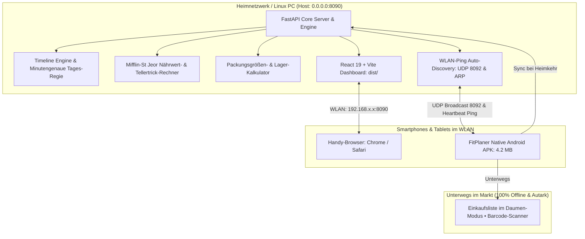

<div align="center">

# 🥗 FitPlaner • Netto & NP Smart Nutrition & Family Manager
### *Das 100% KI-freie, autarke Alltags-Betriebssystem für gesunde Ernährung, Wochen-Budget & Zero-Stress-Kochen*

[](https://github.com/meinzeug/netto-np-planer)
[](https://fastapi.tiangolo.com)
[](https://react.dev)
[-3DDC84?style=for-the-badge&logo=android)](https://capacitorjs.com)
[](https://github.com/meinzeug/netto-np-planer)
[](https://github.com/meinzeug/netto-np-planer)

<br/>

> **FitPlaner** verwandelt den wöchentlichen Netto Marken-Discount & NP Discounter-Einkauf in ein vollautomatisches, wissenschaftlich fundiertes Ernährungs- und Budgeterlebnis.  
> **Kein Abo. Keine Cloud-KI. Keine Küchenwaage beim Kochen. Volle WLAN-Synchronisation im Haushalt.**

---

</div>

<br/>

## 📰 DAS DIGITALE MAGAZIN: REVOLUTION IM FAMILIEN-ALLTAG

<table>
<tr>
<td width="33%" valign="top">

### ⏱️ 1. Tages-Regie & Zeitplan
**Jede Minute genau wissen, was zu tun ist.**
- ☀️ 06:30 Uhr: Stoffwechsel-Hydration
- 🎒 06:45 Uhr: 30-Sekunden-Brotdosen-Grab
- 🍎 10:30 Uhr: Individuelle Fokus-Snacks
- ⏰ 16:45 Uhr: 15-Min.-Feierabend-Alarm
- 🥪 **20:00 Uhr: 12-Min.-Vorabend-Trick** (Dosen für morgen fertig vorbereiten)

</td>
<td width="33%" valign="top">

### 🍽️ 2. Der faire Tellertrick
**Nie wieder am Herd grammgenau wiegen.**
- Gemeinsam **ein** Familiengericht kochen
- Servieren nach intuitiven **Kellenmaßen**:
  - *Dennis (Muskelaufbau)*: 🥄 3 volle Kellen + Beilage
  - *Sarah (Defizit)*: 🥄 1,5 Kellen + 2 Hände Salat
- Nährwerte stimmen auf den Punkt!

</td>
<td width="33%" valign="top">

### 🚶‍♂️ 3. Gang-Laufweg & Daumen
**Stressfrei durch den Supermarkt.**
- Sortiert nach Netto/NP Realität:
  1. *Obst & Gemüse* (Eingang)
  2. *Kühlregal & Frische*
  3. *Fleisch & Fisch*
  4. *Trockensortiment & Vorräte*
- **📱 Daumen-Modus**: 64px Touch-Felder für einhändiges Gehen mit Korb.

</td>
</tr>
<tr>
<td width="33%" valign="top">

### 📅 4. Wöchentliche Budgets
**Multi-Wochen-Planung & Spar-Radar.**
- Beliebig vor- und zurückblättern (KW 36, 37, 38...)
- Individuelles Budget pro Woche (z. B. 120 € oder 60 € am Monatsende)
- Live Restbudget & Spar-Ampel (🟢 / 🟡 / 🔴)
- Netto & NP Ersparnis-Kalkulation.

</td>
<td width="33%" valign="top">

### 📦 5. Vorratskammer & Barcode
**Gegen Lebensmittelverschwendung.**
- EAN-13 Barcode-Scanner & Kassenbon-OCR
- Frische-Ampel nach Mindesthaltbarkeit (MHD)
- **Lager-Abzug**: Vorhandene Zutaten kosten automatisch **0,00 €** auf der Liste!

</td>
<td width="33%" valign="top">

### 📡 6. WLAN-Ping Auto-Discovery
**Zero-Config Synchronisation.**
- UDP-Broadcast Radar auf **Port 8092**
- Subnetz-ARP-Scanner erkennt Handys sofort
- 1-Klick-Kopplung im Web-Installer
- Automatischer Haushalts-Sync nach Heimkehr.

</td>
</tr>
</table>

---

## 🏛️ SYSTEM-ARCHITEKTUR



---

## ⏱️ DIE MINUTENGENAUE TAGES-REGIE

Der neue Ernährungs-Zeitplaner steuert deinen Tag chronologisch und nimmt dir jede mentale Belastung ab:

| Uhrzeit | Station / Mission | Details & Familien-Nutzen |
| :--- | :--- | :--- |
| **06:30** | ☀️ **Morgen-Start & Hydration** | 1 großes Glas lauwarmes Wasser (300–500ml) für Dennis & Sarah (Stoffwechsel-Kick). |
| **06:45** | 🎒 **Brotdosen-Grab-and-Go** | Gestern vorbereitete Dosen & Snackboxen aus dem Kühlschrank in die Taschen packen (**30 Sekunden!**). |
| **07:00** | 🥣 **Frühstück lt. Wochenplan** | Tages-Rezept (z. B. Vollkorn-Knäckebrot mit Bio-Ei & Avocado-Creme). |
| **10:30** | 🍎 **Vormittags-Snack** | Dennis: Handvoll Mandeln (Muskelschutz); Sarah: Apfel & Gurkensticks (Sättigung ohne Kalorienlast). |
| **12:30** | 🍱 **Mittagspause to-go** | Vollwertiges Brotdosen-Gericht (z. B. Kichererbsen-Thunfisch-Salat mit Bio-Ei). Keine teuren Kantinen! |
| **15:30** | 💧 **Nachmittags-Booster** | 500ml Wasser oder Grüntee + gesunder Snack gegen das 15-Uhr-Leistungstief. |
| **16:45** | ⏰ **Feierabend-Vorausblick** | 15 Min. vor Feierabend: Erinnerung an kurzen Netto/NP Halt für den Frische-Pick. |
| **17:15** | 🛒 **Frische-Pick im Markt** | Frischen Fisch, Geflügel oder Babyspinat direkt auf dem Heimweg frisch einpacken. |
| **18:00** | 🍳 **Herd-Regie & Koch-Start** | Ofen/Pfanne anheizen. Schnelle Zubereitung in meist nur 1 Pfanne/Topf. |
| **18:30** | 🍽️ **Familien-Dinner** | Servieren nach dem **fairen Tellertrick** am Herd ohne Küchenwaage. |
| **20:00** | 🥪 **Brotdose für MORGEN vorbereiten** | **Der 12-Minuten-Vorabend-Trick:** Overnight-Oats anrühren, Reste einpacken, Snackboxen füllen. |
| **20:45** | ❄️ **TK-Auftau-Check** | Zutaten für übermorgen zum schonenden Auftauen in das Null-Grad-Fach legen. |
| **21:45** | 🌙 **Abend-Hydration & Bettruhe** | Kräutertee, Magnesium, Regeneration für tiefen REM-Schlaf. |

---

## 🍽️ DER FAIRE TELLERTRICK (KÜCHENWAAGE WAR GESTERN)

Niemand wiegt nach einem anstrengenden Arbeitstag jede Tomate einzeln ab. Der **Tellertrick** übersetzt die wissenschaftlichen BMR/TDEE-Kalorienwerte (Mifflin-St Jeor) direkt in **Küchenmaße am Herd**:

```
🥘 Beispiel: Cremiges Rote-Linsen-Curry mit Babyspinat
├── 👤 Dennis (Ziel: Muskelaufbau • 2.650 kcal)
│   └── 🥄 3 volle Kellen Linsen-Curry + 1 gehäufte Handvoll Naturreis
└── 👤 Sarah (Ziel: Fettabbau • 1.700 kcal)
    └── 🥄 1,5 Kellen Linsen-Curry + 2 lockere Hände Frischer Salat
```

---

## 📱 NATIVE ANDROID APP & AUTO-DISCOVERY RADAR

Die App wurde mit Capacitor kompiliert und läuft als native Android-App:

- **Schlanke APK**: Nur **4,2 MB** (`FitPlaner.apk` liegt im Hauptverzeichnis).
- **Kamera-Unterstützung**: EAN-13 Barcode-Scanner und Kassenbon-Fotografie.
- **100% Offline im Supermarkt**: Wenn das Mobilfunknetz im Discounter abreißt, schaltet die App verzögerungsfrei auf den Offline-Cache um.
- **WLAN-Auto-Discovery Radar (Port 8092)**:
  - Der Linux-Server sendet und lauscht auf allgemeine UDP-Broadcast-Pings.
  - Sobald das Smartphone zu Hause ins WLAN kommt, gleicht es abgehakte Artikel und verbrauchte Vorräte vollautomatisch mit dem PC ab.

---

## 🚀 INSTALLATION AUF LINUX (UBUNTU / DEBIAN / FEDORA / ARCH)

Im Hauptverzeichnis befindet sich das All-in-One Installationsskript [`setup.sh`](setup.sh):

```bash
# 1. Repository klonen
git clone https://github.com/meinzeug/netto-np-planer.git
cd netto-np-planer

# 2. Lokales Setup ausführen (erstellt .venv, baut Frontend & richtet Desktop-Starter ein)
./setup.sh

# 3. Server starten
./run.sh
```

### 🌐 Adressen im Netzwerk:
- **Am PC (Browser)**: `http://localhost:8090`
- **Vom Smartphone im WLAN**: `http://<DEINE-PC-IP>:8090` *(wird vom Skript automatisch ausgegeben)*
- **Direkter APK-Download**: `http://<DEINE-PC-IP>:8090/FitPlaner.apk`
- **Linux-Anwendungsmenü**: Einfach nach **„FitPlaner (Netto & NP)“** suchen!

---

## 🛠️ TECH-STACK & QUALITÄTSVERSPRECHEN

| Schicht | Technologie | Details |
| :--- | :--- | :--- |
| **Backend** | Python 3.12, FastAPI, Uvicorn | Vollständig asynchron, Pydantic v2 validiert, gebunden an `0.0.0.0` |
| **Frontend** | React 19, TypeScript, Vite, Tailwind CSS | Komponenten-Architektur, 0 TypeScript-Fehler, < 1s Build-Zeit |
| **Mobile** | Capacitor 7, Android SDK 34/35 | Native APK, Kamera-Berechtigungen, Offline-PWA-Fallback |
| **Netzwerk** | UDP Socket Broadcast, ARP Subnet-Probe | Port 8092 Auto-Discovery ohne manuelle IP-Konfiguration |
| **Ernährung** | Open Food Facts API, Marktguru API | NOVA-Klassifikation (1–4), E-Nummern-Audit, Clean-Eating-Filter |
| **KI-Freiheit** | 100% Deterministisch | Keine monatlichen Kosten, keine externen LLM-Abos, absolute Datensouveränität |

---

## 🧪 AUTOMATISIERTE TESTS

Die gesamte Logik wird durch **30 automatisierte Backend-Unit-Tests** abgesichert:

```bash
.venv/bin/python3 -m unittest discover backend/tests
```

```
..............................
----------------------------------------------------------------------
Ran 30 tests in 0.105s

OK
```
- `test_timeline_schedule.py`: Testet 13 chronologische Stationen, Weckzeit-Shifting & Vorabend-Prep.
- `test_installer.py`: Testet QR-Code-SVG Generierung, LAN-IP Erkennung und Geräte-Kopplung.
- `test_daily_hub.py`: Testet Öffnungszeiten-Abgleich, Frische-Pick & Tellertrick.
- `test_budget_and_weeks.py`: Testet ISO-8601 Wochen-Berechnung & Budget-Ampel.
- `test_nutrition.py`: Testet Mifflin-St Jeor BMR/TDEE & Portionsskalierung.
- `test_pantry.py`: Testet Packungsgrößen, Restmengen & MHD-Ampel.
- `test_health_filter.py`: Testet Ausschluss von E-Nummern (E250, E621) & verstecktem Zucker.

---

## 📄 LIZENZ & CREDITS

Entwickelt für **Dennis & Familie** von `meinzeug`.  
100% Open Source, frei nutzbar für maximale Gesundheit und faire Haushaltsfinanzen.
